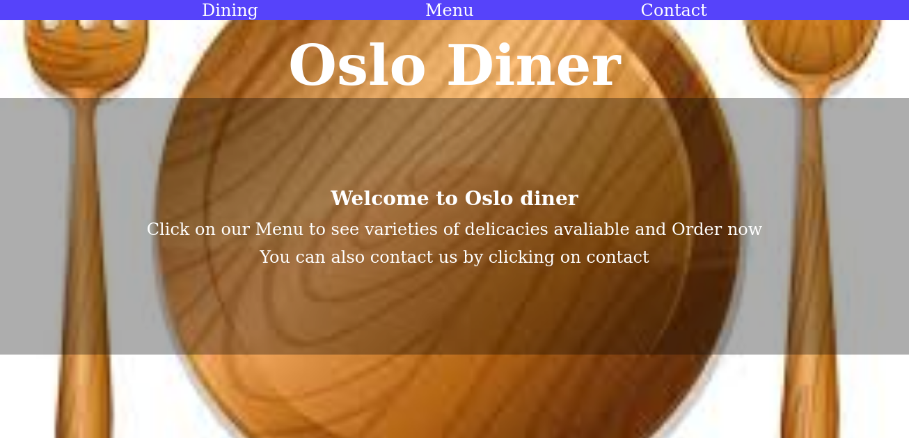

# Restaurant-page (Oslo-diner)
I used what we’ve learned and take a chance to continue practicing DOM manipulation by dynamically rendering a simple restaurant homepage! At the end, we use use JavaScript alone to generate the entire contents of the website!
 

- The application describes what Oslo diner is all about
- The application displays all menu of food available
- The appplication allows users to fill the contact form

## Built With

- HTML
- CSS
- Javascript(ES6)
- Webpack4

## Prerequisites
- You need to have node already installed with npm

## Getting Started

To get a local copy up and running follow these simple example steps.

### Setup

1.  Clone this repository with
   - <code> `git clone https://github.com/Haroonabdulrazaq/Restaurant-page.git` </code>
2.  Change to the project directory by entering
    - <code>`cd Restaurant-page` </code>
3. Open in Editor of choice
4.  
   - <code> npm install </code> To install all package dependencies.
   - <code> npm run dev </code> To run project in dveleopment mode.
   - <code> ./node_modules/.bin/webpack --watch </code> To watch files

## Authors

👤 **Haroon Abdulrazaq**

- Github: [@haroonabdulrazaq](https://github.com/githubhandle)
- Twitter: [@Hanq_o](https://twitter.com/twitterhandle)
- Linkedin: [Haroonabdulrazaq](https://www.linkedin.com/in/haroonabdulrazaq)

## 🤝 Contributing

Contributions, issues and feature requests are welcome!

Feel free to check the [issues page](issues/).

## Show your support

Give a ⭐️ if you like this project!

## Acknowledgments

- Microverse
- The Odin Project

## 📝 License

This project is [MIT](lic.url) licensed.